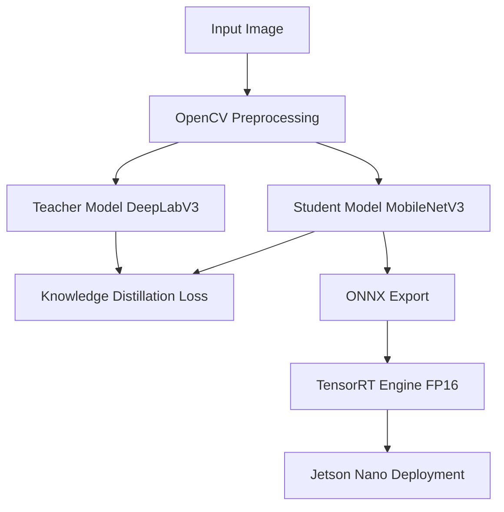

# Resource-Aware Image Segmentation for Edge Robotics

## 1. Project Overview
This project implements a resource-aware semantic image segmentation system tailored for edge robotics, specifically targeting the NVIDIA Jetson Nano. It uses Knowledge Distillation (KD) to train a lightweight student model (MobileNetV3) using a high-capacity teacher model (DeepLabV3).

## 2. Motivation
Deep learning models for semantic segmentation are typically computationally expensive and memory-intensive, making them unsuitable for deployment on edge robotics platforms with limited resources (like the Jetson Nano). This project bridges the gap by providing a pipeline to distill knowledge from heavy models into efficient edge-friendly architectures.

## 3. Edge Robotics Context
Edge robotics requires real-time processing under strict power and memory constraints. The target hardware, NVIDIA Jetson Nano, features a 128-core Maxwell GPU. By utilizing TensorRT and efficient architectures, we maximize throughput while minimizing latency.

## 4. System Architecture

## 5. Dataset
The project uses a configurable dataset interface. By default, it supports Pascal VOC equivalents. A synthetic generator is included for rapid pipeline validation without downloading massive datasets.

## 6. Teacher Model
The teacher model is `DeepLabV3` with a `ResNet-50` backbone. It provides high-quality soft targets for the student during distillation.

## 7. Student MobileNetV3 Model
The student model uses a `MobileNetV3-Small` backbone with a custom lightweight segmentation head, designed specifically to reduce MACs and parameter count.

## 8. Knowledge Distillation
We implement logits-based knowledge distillation. The total loss is a weighted sum of the standard Cross-Entropy loss (against ground truth) and KL-Divergence loss (against softened teacher logits).

## 9. Training
To train the teacher:
`python scripts/train_teacher.py`

To train the baseline student (no KD):
`python scripts/train_student.py`

To train the student with KD:
`python scripts/distill.py`

## 10. Evaluation
`python scripts/evaluate.py --model student_kd --checkpoint models/student_best.pth`

## 11. ONNX Export
`python scripts/export_onnx.py --checkpoint models/student_best.pth`

## 12. TensorRT Optimization
`python deployment/tensorrt/build_engine.py --onnx models/student.onnx --engine models/student.engine --fp16`

## 13. Jetson Nano Deployment
`python deployment/jetson/app.py --engine models/student.engine`

## 14. Benchmarking
`python scripts/benchmark.py`

## 15. Results
See benchmark script output. Note that Jetson-specific numbers are simulated if not run directly on Jetson hardware.

## 16. Limitations
- TensorRT engine building requires physical hardware matching the deployment target.
- INT8 calibration is not fully implemented; FP16 is used by default.

## 17. Reproduction Instructions
1. `python -m venv .venv`
2. `.venv\Scripts\activate` (Windows) or `source .venv/bin/activate` (Linux)
3. `pip install -r requirements.txt`
4. Run scripts in `scripts/` directory as described.

## 18. Future Work
- Implement feature-map distillation.
- Complete INT8 calibration pipeline with TensorRT.
- Integrate ROS2 for robotics middleware.
<!-- update -->

<!-- update -->

<!-- update -->

<!-- update -->

<!-- revised by Tung Le -->
